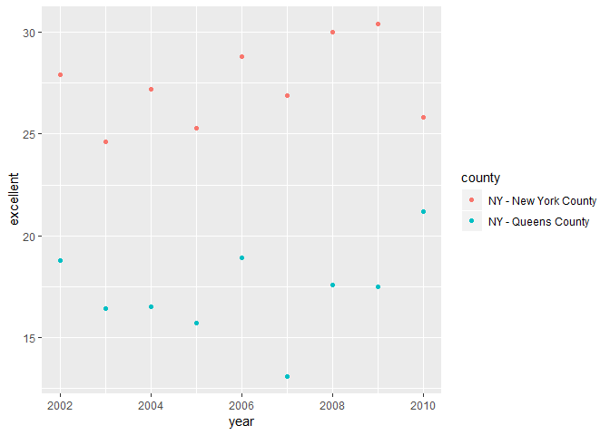

p8105\_hw2\_rt2712
================
Rachel Tsong
5 October 2018

Problem 1
=========

Step 1
------

Load and clean up data

``` r
library(tidyverse)
```

    ## -- Attaching packages ----------------------------------------------------------- tidyverse 1.2.1 --

    ## v ggplot2 3.0.0     v purrr   0.2.5
    ## v tibble  1.4.2     v dplyr   0.7.6
    ## v tidyr   0.8.1     v stringr 1.3.1
    ## v readr   1.1.1     v forcats 0.3.0

    ## -- Conflicts -------------------------------------------------------------- tidyverse_conflicts() --
    ## x dplyr::filter() masks stats::filter()
    ## x dplyr::lag()    masks stats::lag()

``` r
subway_data = (
  read_csv("./data/NYC_Transit_Subway_Entrance_And_Exit_Data.csv") %>%
  janitor::clean_names() %>%
  select(line:entry, vending, ada) %>%
  mutate(entry = recode(entry, "YES" = TRUE, "NO" = FALSE))
)
```

    ## Parsed with column specification:
    ## cols(
    ##   .default = col_character(),
    ##   `Station Latitude` = col_double(),
    ##   `Station Longitude` = col_double(),
    ##   Route8 = col_integer(),
    ##   Route9 = col_integer(),
    ##   Route10 = col_integer(),
    ##   Route11 = col_integer(),
    ##   ADA = col_logical(),
    ##   `Free Crossover` = col_logical(),
    ##   `Entrance Latitude` = col_double(),
    ##   `Entrance Longitude` = col_double()
    ## )

    ## See spec(...) for full column specifications.

### Summary of dataset

First I imported the data from the .csv file and cleaned the names so that the dataset is easier to work with. After that, I selected the columns for line, station name, station latitude and longitude, entrance type, routes served, vending, and ADA compliance. Lastly, I changed the entry column into a logical vector. The resulting data set is 1868 x 19. These data give information about subway stations and their entrances/exits including whether or not they have ticket vending machines, whether or not they are accessible, location, and routes served. Right now, the data frame is not yet tidy because there are variables in the column names: route1-route11. These columns need to be reformatted so that each variable has its own column, each observation has its own row, and there is a single value in every cell.

Step 3
------

### Answer questions:

**How many distinct stations?**

``` r
distinct(subway_data, line, station_name)
```

    ## # A tibble: 465 x 2
    ##    line     station_name            
    ##    <chr>    <chr>                   
    ##  1 4 Avenue 25th St                 
    ##  2 4 Avenue 36th St                 
    ##  3 4 Avenue 45th St                 
    ##  4 4 Avenue 53rd St                 
    ##  5 4 Avenue 59th St                 
    ##  6 4 Avenue 77th St                 
    ##  7 4 Avenue 86th St                 
    ##  8 4 Avenue 95th St                 
    ##  9 4 Avenue 9th St                  
    ## 10 4 Avenue Atlantic Av-Barclays Ctr
    ## # ... with 455 more rows

There are 465 unique stations.

**How many stations are ada compliant?**

``` r
filter(
  (distinct(subway_data, line, station_name, .keep_all = TRUE)),
  ada == TRUE)
```

    ## # A tibble: 84 x 19
    ##    line  station_name station_latitude station_longitu~ route1 route2
    ##    <chr> <chr>                   <dbl>            <dbl> <chr>  <chr> 
    ##  1 4 Av~ Atlantic Av~             40.7            -74.0 B      Q     
    ##  2 4 Av~ DeKalb Av                40.7            -74.0 B      Q     
    ##  3 4 Av~ Pacific St               40.7            -74.0 B      Q     
    ##  4 42nd~ Grand Centr~             40.8            -74.0 GS     4     
    ##  5 6 Av~ 34th St                  40.7            -74.0 B      D     
    ##  6 6 Av~ 47-50th Sts~             40.8            -74.0 B      D     
    ##  7 6 Av~ Church Av                40.6            -74.0 F      <NA>  
    ##  8 63rd~ 21st St                  40.8            -73.9 F      <NA>  
    ##  9 63rd~ Lexington Av             40.8            -74.0 F      <NA>  
    ## 10 63rd~ Roosevelt I~             40.8            -74.0 F      <NA>  
    ## # ... with 74 more rows, and 13 more variables: route3 <chr>,
    ## #   route4 <chr>, route5 <chr>, route6 <chr>, route7 <chr>, route8 <int>,
    ## #   route9 <int>, route10 <int>, route11 <int>, entrance_type <chr>,
    ## #   entry <lgl>, vending <chr>, ada <lgl>

84 distinct stations are ADA compliant.

**What proportion of entrances/exits without vending allow entrance?**

``` r
filter(subway_data, vending == "NO")
```

    ## # A tibble: 183 x 19
    ##    line  station_name station_latitude station_longitu~ route1 route2
    ##    <chr> <chr>                   <dbl>            <dbl> <chr>  <chr> 
    ##  1 4 Av~ 53rd St                  40.6            -74.0 R      <NA>  
    ##  2 4 Av~ 77th St                  40.6            -74.0 R      <NA>  
    ##  3 4 Av~ 9th St                   40.7            -74.0 F      G     
    ##  4 4 Av~ Bay Ridge Av             40.6            -74.0 R      <NA>  
    ##  5 42nd~ Grand Centr~             40.8            -74.0 GS     4     
    ##  6 42nd~ Grand Centr~             40.8            -74.0 GS     4     
    ##  7 6 Av~ 7th Av                   40.7            -74.0 F      <NA>  
    ##  8 6 Av~ 7th Av                   40.7            -74.0 F      <NA>  
    ##  9 6 Av~ 7th Av                   40.7            -74.0 F      <NA>  
    ## 10 6 Av~ 7th Av                   40.7            -74.0 F      <NA>  
    ## # ... with 173 more rows, and 13 more variables: route3 <chr>,
    ## #   route4 <chr>, route5 <chr>, route6 <chr>, route7 <chr>, route8 <int>,
    ## #   route9 <int>, route10 <int>, route11 <int>, entrance_type <chr>,
    ## #   entry <lgl>, vending <chr>, ada <lgl>

``` r
filter(subway_data, vending == "NO", entry == TRUE)
```

    ## # A tibble: 69 x 19
    ##    line  station_name station_latitude station_longitu~ route1 route2
    ##    <chr> <chr>                   <dbl>            <dbl> <chr>  <chr> 
    ##  1 4 Av~ 9th St                   40.7            -74.0 F      G     
    ##  2 6 Av~ 7th Av                   40.7            -74.0 F      <NA>  
    ##  3 6 Av~ 7th Av                   40.7            -74.0 F      <NA>  
    ##  4 6 Av~ 7th Av                   40.7            -74.0 F      <NA>  
    ##  5 6 Av~ 7th Av                   40.7            -74.0 F      <NA>  
    ##  6 6 Av~ 7th Av                   40.7            -74.0 F      <NA>  
    ##  7 6 Av~ 7th Av                   40.7            -74.0 F      <NA>  
    ##  8 6 Av~ 7th Av                   40.7            -74.0 F      <NA>  
    ##  9 6 Av~ 7th Av                   40.7            -74.0 F      <NA>  
    ## 10 6 Av~ Bergen St                40.7            -74.0 F      G     
    ## # ... with 59 more rows, and 13 more variables: route3 <chr>,
    ## #   route4 <chr>, route5 <chr>, route6 <chr>, route7 <chr>, route8 <int>,
    ## #   route9 <int>, route10 <int>, route11 <int>, entrance_type <chr>,
    ## #   entry <lgl>, vending <chr>, ada <lgl>

I ran the first line of the code chunk above to tell me how many stations don't have vending and the second line to tell me how many stations that do not offer vending allow entrance. I can conclude from the resulting tibbles that 69/183 or 37.7% of stations that do not offer vending do allow entrance.

Step 4
------

Reformat route \# and route name, answer questions

``` r
subway_data_tidy = gather(subway_data, key = route_number, value = route, route1:route11)

filter(
  (distinct(subway_data_tidy, line, station_name, .keep_all = TRUE)),
  route == "A"
)
```

    ## # A tibble: 60 x 10
    ##    line  station_name station_latitude station_longitu~ entrance_type entry
    ##    <chr> <chr>                   <dbl>            <dbl> <chr>         <lgl>
    ##  1 42nd~ Times Square             40.8            -74.0 Stair         TRUE 
    ##  2 8 Av~ 125th St                 40.8            -74.0 Stair         TRUE 
    ##  3 8 Av~ 145th St                 40.8            -73.9 Stair         TRUE 
    ##  4 8 Av~ 14th St                  40.7            -74.0 Easement      TRUE 
    ##  5 8 Av~ 168th St - ~             40.8            -73.9 Stair         TRUE 
    ##  6 8 Av~ 175th St                 40.8            -73.9 Elevator      TRUE 
    ##  7 8 Av~ 181st St                 40.9            -73.9 Door          TRUE 
    ##  8 8 Av~ 190th St                 40.9            -73.9 Door          TRUE 
    ##  9 8 Av~ 34th St                  40.8            -74.0 Elevator      TRUE 
    ## 10 8 Av~ 42nd St                  40.8            -74.0 Easement      TRUE 
    ## # ... with 50 more rows, and 4 more variables: vending <chr>, ada <lgl>,
    ## #   route_number <chr>, route <chr>

``` r
filter(
  (distinct(subway_data_tidy, line, station_name, .keep_all = TRUE)),
  route == "A", ada == TRUE
)
```

    ## # A tibble: 17 x 10
    ##    line  station_name station_latitude station_longitu~ entrance_type entry
    ##    <chr> <chr>                   <dbl>            <dbl> <chr>         <lgl>
    ##  1 8 Av~ 14th St                  40.7            -74.0 Easement      TRUE 
    ##  2 8 Av~ 168th St - ~             40.8            -73.9 Stair         TRUE 
    ##  3 8 Av~ 175th St                 40.8            -73.9 Elevator      TRUE 
    ##  4 8 Av~ 34th St                  40.8            -74.0 Elevator      TRUE 
    ##  5 8 Av~ 42nd St                  40.8            -74.0 Easement      TRUE 
    ##  6 8 Av~ 59th St                  40.8            -74.0 Easement      TRUE 
    ##  7 8 Av~ Inwood - 20~             40.9            -73.9 Elevator      TRUE 
    ##  8 8 Av~ West 4th St              40.7            -74.0 Elevator      TRUE 
    ##  9 8 Av~ World Trade~             40.7            -74.0 Stair         TRUE 
    ## 10 Broa~ Times Squar~             40.8            -74.0 Stair         TRUE 
    ## 11 Broa~ 59th St-Col~             40.8            -74.0 Stair         TRUE 
    ## 12 Broa~ Times Square             40.8            -74.0 Easement      TRUE 
    ## 13 Cana~ 8th Av                   40.7            -74.0 Stair         TRUE 
    ## 14 Fran~ Franklin Av              40.7            -74.0 Door          TRUE 
    ## 15 Fult~ Euclid Av                40.7            -73.9 Elevator      TRUE 
    ## 16 Fult~ Franklin Av              40.7            -74.0 Stair         TRUE 
    ## 17 Rock~ Howard Beach             40.7            -73.8 Elevator      TRUE 
    ## # ... with 4 more variables: vending <chr>, ada <lgl>, route_number <chr>,
    ## #   route <chr>

There are 60 distinct subway stations that serve the A train, and 17 of these stations that serve the A train are ADA compliant.

Problem 2
=========

Step 1
------

Load and clean up data

``` r
library(readxl)

trash_wheel = (
  read_excel("./data/HealthyHarborWaterWheelTotals2018-7-28.xlsx", sheet = 1, range = "A2:N336") %>%
  janitor::clean_names() %>%
  drop_na(dumpster) %>% 
  mutate(sports_balls = as.integer(round(sports_balls)))
)
```

``` r
precip_2017 = (
  read_excel("./data/HealthyHarborWaterWheelTotals2018-7-28.xlsx", sheet = 4, range = "A2:B14") %>% 
  janitor::clean_names() %>%
  mutate(year = "2017")
)

precip_2016 = (
  read_excel("./data/HealthyHarborWaterWheelTotals2018-7-28.xlsx", sheet = 5, range = "A2:B14") %>% 
  janitor::clean_names() %>%
  mutate(year = "2016")
)

precip_data = (
  bind_rows(precip_2016, precip_2017) %>%
  mutate(month = month.name[month]) %>%
  rename(total_inches = total)
)
```

Step 2
------

**Description of Data**

In the trash\_wheel data set, there are 285 observations. These data show the amount of trash that Mr. Trash Wheel picked up from the Jones Falls River in Baltimore from May 2014 until July 2018. The columns in the data set show the types of trash collected (e.g. cigarette butts, glass bottles, etc.) as well as temporal information. Additionally, the data give the number of homes powered by incineration of the trash collected. I checked over these column names and thought they were named appropriately. I considered changing the variable names for weight and volume, since these were the only column headings which included units and I wanted consistency; however, I decided that the units were essential to understanding the values. Each row represents the contents of a single full "dumpster," which is what Mr. Trash Wheel deposits the trash collected into. The median number of sports balls collected per dumpster in 2016 is 26 balls.

The precip\_data data set gives the total amount of precipitation per month for 2016 and 2017. In the original data, the units for the precipitation total per month was given in the title. I decided to provide that information in the column name for totals, so I renamed that column total\_inches. I thought this was important information to retain to prevent ambiguity. The total amount of precipitation in 2017 was 32.93 inches.

Problem 3
=========

Step 1
------

Load and clean up data

``` r
devtools::install_github("p8105/p8105_datasets")
```

    ## Downloading GitHub repo p8105/p8105_datasets@master
    ## from URL https://api.github.com/repos/p8105/p8105_datasets/zipball/master

    ## Installation failed: Not Found (404)

``` r
library(p8105.datasets)

data(brfss_smart2010)

brfss_data = (
  janitor::clean_names(brfss_smart2010) %>%
  filter(topic == "Overall Health") %>%
  select(year:locationdesc, response, data_value) %>%
  rename(state = locationabbr, county = locationdesc) %>%
  spread(key = response, value = data_value) %>%
  janitor::clean_names() %>%
  mutate(upper_rating = excellent + very_good) %>%
  select(year:excellent, very_good, good, fair, poor, upper_rating)
)
```

In the code above, I loaded the data set and selected the rows for overall health and the columns for the relevent information. After that, I noticed that the variable names for location were not very informative, so I changed them to "state" and "county" to be more clear what information was in each column. Then I made the response to the question "How is your general health?" a column and rows in this column indicate the proportion of responders who gave each rating at a particular location. Last, I made a variable for "upper rating" to indicate the proportion of responders who answered "excellent" or "very good" and then re-ordered the columns in a logical way.

Step 2
------

### Answer questions

**Locations**

There are 404 different counties in the dataset, each representing a unique location. There are 51 distinct entries in the "state" category, which at first I though was a mistake, but upon closer inspection I discovered that Washington, D.C. had its own row and all 50 states are represented as well. Using the summary table obtained by running `summary(as.factor(brfss_data$state))` it can be determined that New Jersey has the most observations (146).

**2002 Excellent Responses**

In 2002, the median proportion of "excellent" responses was 23.6.

**Plots**

``` r
library(ggplot2)

brfss_histo = filter(brfss_data, year == 2002)

ggplot(brfss_histo, aes(x = excellent)) + 
  geom_histogram()
```

    ## `stat_bin()` using `bins = 30`. Pick better value with `binwidth`.

    ## Warning: Removed 2 rows containing non-finite values (stat_bin).


``` r
brfss_scatter = (
  filter(brfss_data, county == "NY - New York County" | county == "NY - Queens County")
)

ggplot(brfss_scatter, aes(x = year, y = excellent, color = county)) + 
  geom_point()
```


